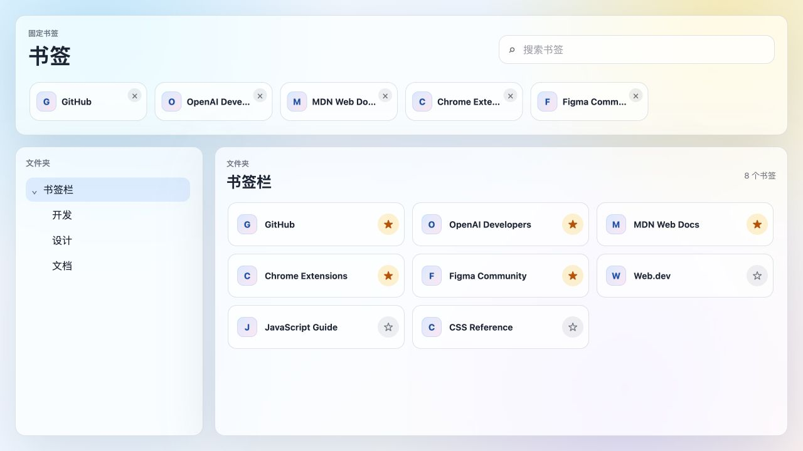
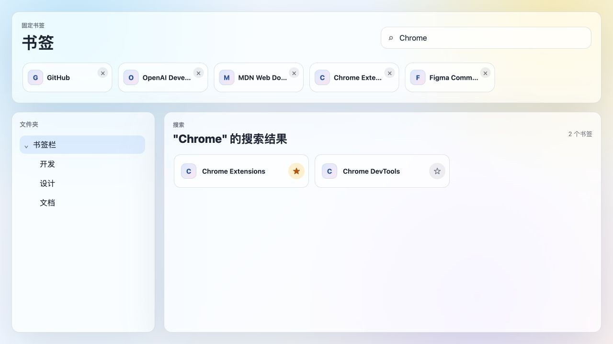
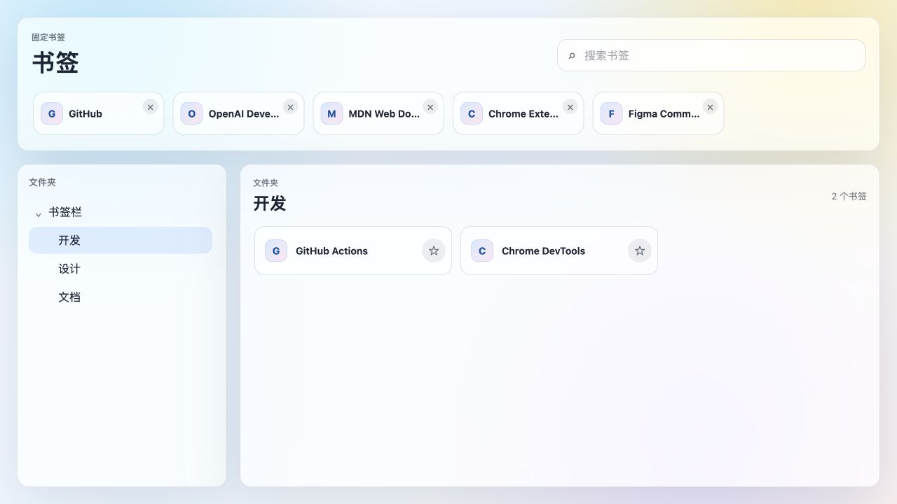

# Bookmark New Tab Extension / 书签新标签页

[中文](#中文) · [English](#english)

## 中文

一个轻量、无依赖的 Chrome 扩展，用整洁、可搜索的界面取代默认新标签页，并展示你现有的 Chrome 书签。

扩展完全在浏览器本地运行，无需构建步骤，不依赖外部软件包，也不会将书签数据发送到服务器。

### 界面预览

#### 书签总览



| 搜索书签 | 浏览文件夹 |
| --- | --- |
|  |  |

所有截图都使用虚构的示例书签，不包含任何个人书签数据。

### 功能

- 通过可折叠侧边栏浏览 Chrome 书签文件夹。
- 按书签标题或 URL 搜索。
- 将常用书签固定在页面顶部。
- 通过拖放调整当前文件夹中的书签顺序。
- 在当前标签页打开书签，或使用 Command/Ctrl + 单击在后台标签页打开。
- 使用 `chrome.storage.local` 在本地保存已固定的书签 ID。

### 从源码安装

1. 下载或克隆本仓库。
2. 在 Chrome 中打开 `chrome://extensions`。
3. 启用右上角的“开发者模式”。
4. 选择“加载已解压的扩展程序”。
5. 选择本仓库文件夹。
6. 打开一个新标签页。

### 权限

扩展仅请求以下权限：

- `bookmarks`：显示 Chrome 书签并调整其顺序。
- `storage`：在本地记住已固定的书签 ID。

### 开发

这是一个无依赖的 Manifest V3 扩展。直接编辑 HTML、CSS 或 JavaScript 文件，然后在 `chrome://extensions` 中点击扩展的“重新加载”即可查看更改。

### 项目结构

```text
manifest.json            扩展元数据和权限
newtab.html              新标签页页面结构
newtab.js                应用状态与事件协调
bookmarkService.js       Chrome 书签 API 适配层
bookmarkNavigation.js    书签打开行为
treeBuilder.js           书签树标准化与遍历
search.js                书签展平与搜索
pinned.js                固定书签持久化
ui/                      侧边栏、网格和固定栏渲染
styles.css               响应式玻璃风界面
```

### 隐私

扩展不包含数据分析、广告、远程脚本或网络请求。书签内容始终保留在用户的浏览器配置中。

### 许可证

[MIT License](LICENSE)

---

## English

A lightweight, dependency-free Chrome extension that replaces the default new-tab page with a clean, searchable view of your existing Chrome bookmarks.

The extension runs entirely in the browser. It has no build step, no external dependencies, and does not send bookmark data to a server.

### Screenshots

See the [interface preview](#界面预览) above. Every screenshot uses fictional sample bookmarks and contains no personal bookmark data.

### Features

- Browse Chrome bookmark folders in a collapsible sidebar.
- Search bookmark titles and URLs.
- Pin frequently used bookmarks to the top of the page.
- Drag bookmarks to reorder them within the selected folder.
- Open a bookmark in the current tab, or use Command/Ctrl-click for a background tab.
- Store pinned bookmark IDs locally with `chrome.storage.local`.

### Install from source

1. Download or clone this repository.
2. Open `chrome://extensions` in Chrome.
3. Enable **Developer mode**.
4. Select **Load unpacked**.
5. Choose this repository folder.
6. Open a new tab.

### Permissions

The extension requests only:

- `bookmarks` to display and reorder the user's Chrome bookmarks.
- `storage` to remember pinned bookmark IDs locally.

### Development

This is a dependency-free Manifest V3 extension. Edit the HTML, CSS, or JavaScript files directly, then select **Reload** for the extension on `chrome://extensions`.

### Project structure

```text
manifest.json            Extension metadata and permissions
newtab.html              New-tab page shell
newtab.js                Application state and event coordination
bookmarkService.js       Chrome bookmarks API adapter
bookmarkNavigation.js    Bookmark opening behavior
treeBuilder.js           Bookmark tree normalization and traversal
search.js                Bookmark flattening and search
pinned.js                Pinned bookmark persistence
ui/                      Sidebar, grid, and pinned-bar rendering
styles.css               Responsive glass-style interface
```

### Privacy

The extension does not include analytics, advertising, remote scripts, or network requests. Bookmark content remains in the user's browser profile.

### License

[MIT License](LICENSE)
